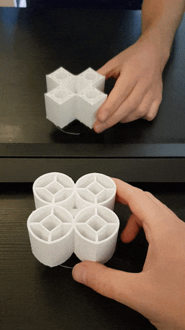
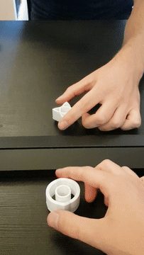

# Impossible Objects

Based on the papers by [Kokichi Sugihara](http://www.isc.meiji.ac.jp/~kokichis/Welcomee.html), I have implemented
the calculations to make various ambiguous cylinders. The end product is an exhibition for [Bekk](https://www.bekk.no/)
at Teknisk Museum in Oslo, with various figures 3D-printed.

## --> [View all and download the files on Thingiverse](https://www.thingiverse.com/Matsemann/collections/matsemanns-ambiguous-cylinders) <--

 |  | 


----

To view all or get the files to print yourself, check the big link above the pictures. 
[**View the implementation here**](https://matsemann.github.io/impossible-objects/). (What this repo is about) Drag with mouse to look around.
What you see is an object and the mirror reflection being something else. A circle from one direction, square from other.

`src` is a folder containing the web-app. Run with `npm install` and `npm run watch` from root.
The frontend does the calculations and allow easy visualization of the paths.

`poster` contains files and description (in Norwegian) for a poster to accompany the exhibition.

`3dfiles` contains the end result and vector files. `svgshapes.ai` contains the 2D shapes, that is then exported to SVG-strings for the webapp.
The various `*.obj` files are output from the webapp, giving the shapes needed for the illusions to work.
The obj files are then imported into [Blender](https://www.blender.org/), and further edited. From there the shapes are exported as
`*.stl` files to be opened in Ultimaker Cura and printed.

# Workflow

More for my own use, so I can remember...

## Create SVG paths

I draw them in Illustrator using pen tool, from 0px to 100px. When happy, copy the path to clipboard.
Paste it into some texteditor. The SVG will contain a path element with a `d` attribute. Copy that into `svgCalc.js` to make us
of it as a function.

## Calculate impossible shape

Make pairs of functions matching the wanted shapes from both viewing directions, ala
```javascript
let circleSquare = [
    {func1: svgFuncBinary(svgHalfCircle), func2: svgFuncBinary(svgTriangle)},
    {func1: inverse(svgFuncBinary(svgHalfCircle)), func2: inverse(svgFuncBinary(svgTriangle))},
];
```
and pass it to the intersections-calculator. The resulting `obj`-file
is also made, fetch it from console by typing `copy(window.objFile)` and paste it into a text editor.

## Edit file in Blender

Import the obj file, select `Object -> Transform -> Geometry to Origin` to get it somewhere visible.
Scale it `S` to 0.2 or so that it's approx 4units = 4cms wide. Apply the scale, `ctrl + a`. Height approx 5 units.

If the object contains several paths, they may need to be connected or split.
To split, go into edit mode, select a vertex, press `L` to select all linked, and then `P` to separate.
To join, select two vertices to join and press `F`.


### Alt 1
Next step is to transform the shape into something with width and mass. Convert it into a curve using `alt + C`.
Add a bevel object, a line going from (-0.5,0.5) in Y. This should add a shape to the curve. Change value of `Twisting` to
something that looks good. May have to select `Minimum` and manually twist vertices using `Ctrl + T`.
Select the shape again in object mode and press `alt + C` to convert it back to a mesh, now being more than a thin line.

### Alt
Go into edit mode. Select all vertices and extrude `E`. Press `Esc`. Can then either scale `S` to 0.8, shrinken `alt+S` to -0.4, or
scale twice for only `x` and `y`. See what looks best.

Next, we should make it solid. First way is to make it like a cylinder. Select all vertices, extrude `E`, and move the new
vertices in the `Z` direction to get the proper height. Press `S`, `Z`, `0` to scale the vertices to same height to get a flat base.

Other way is to fill in the top. Again extrude, but scale `S` the new vertices into a small point in the middle, and then
select `merge at center` from the tool menu. Or select all vertices and press `F` to generate face, or `Grid Fill`.

In both cases, it can be nice to select all vertices and recalculate normals.


To make a support it can rotate on, make a cylinder that's 0.5cm diameter and put it through some part of the object. 
Select the original object, then select `Add modifier` -> `Boolean` and select the cylinder. Select `Difference` to cut
a cylinder hole. If the modifier doesn't work, try to use `Mesh` -> `Clean up` -> `Fill holes`.

Then export as stl. Select only current object, and scale * 10

## Printing

Enabling the experimental setting "adaptive layers" seems to work well.
Can then print the cylinder lowres, and then shape-paths finer, without it taking forever.
